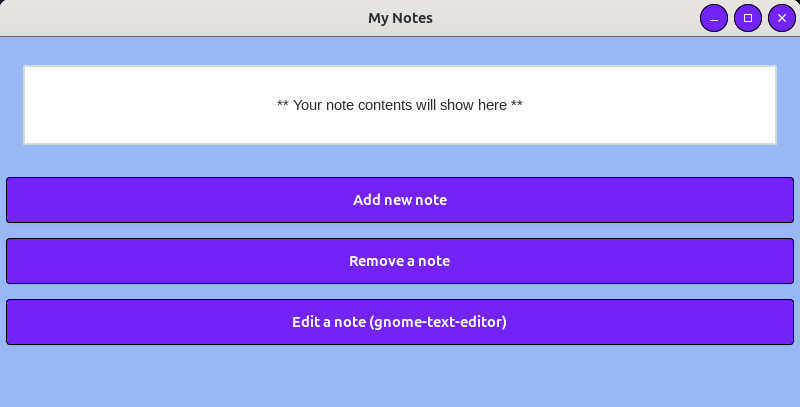
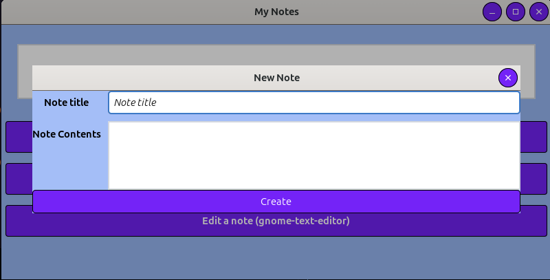
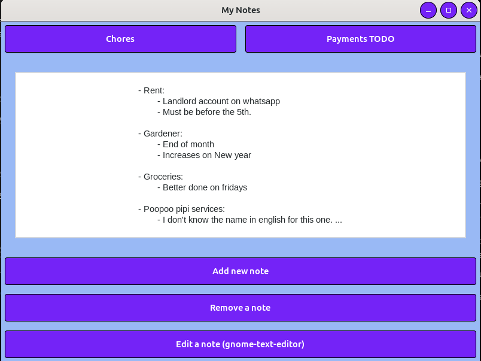
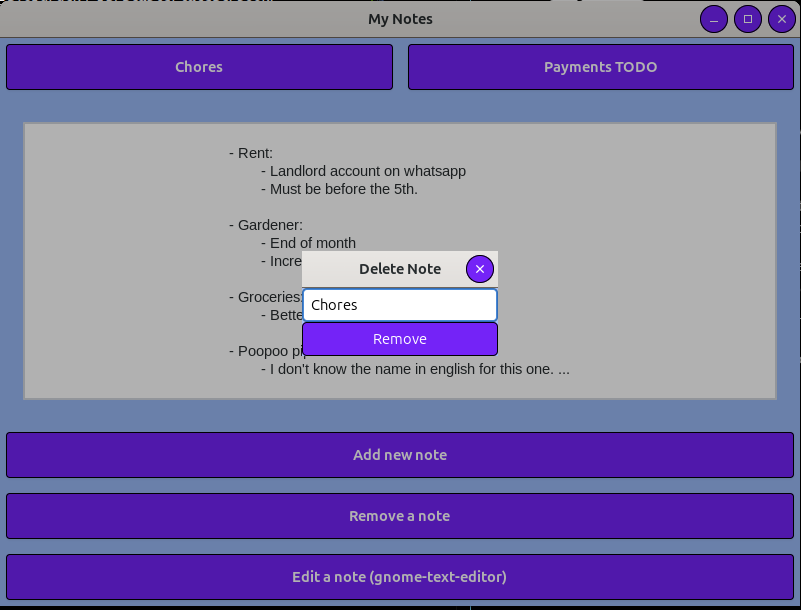

# gtk-rs-notes-app
This is a simple project I've been working on to kickoff my Rust "learn by doing" track.

# Libraries and set up.
Be sure to install the gtk4 libraries. You can follow [this book's installation section](https://gtk-rs.org/gtk4-rs/stable/latest/book/installation.html) depending on your OS.

Use `cargo build` to build the project and install it's dependencies.

You can run it using `cargo run`.

# Usage

When running the proyect you will be displayed with a simple window as follows:

Clicking on "Add a note" will pop up a small dialog box to input the note information:

After Filing up the information and creating the note, it will be displayed as a button. By default you can create up to 5 notes, that can be changed in the code on [notes.rs](src/notes.rs):

- The constant `MAX_NOTES` handles the maximum notes
- The constant `NOTES_PATH` is preset to create a `notes` directory and save notes there.

You can see the note's contents by clicking the button with its title:

If there are notes available, clicking on "Remove a note" will pop up a dialog window to input the title of the note to be deleted:

If you need to edit the note on a text editor you can click the "Edit a note (\<program\>)" button. The editor to be used is preset on [gtk_handlers.rs](src/gtk_handlers.rs) to "gnome-text-editor", it also expects to be accessed via the syntax `<program> <note-path>`.

- The constant `TEXT_EDITOR` is preset to "gnome-text-editor".

# Next steps

As stated above, this is just a fun project for me to get familiar with Rust while doing something useful, and so far it satisfies my needs which are:
- Tackling a useful scenario for me which is being able to:
    - Centralize notes
    - Be able to easily check these notes
    - Add new notes
    - Delete old notes
    - Edit notes if necessary

- Be made by me

However I will most likely add functionality in the future. Some ideas are:
    
- Being able to remove or edit focused note.
- A confirmation box when deleting a note (redundant right now as you have to input the title of the note)
- Be able to edit the note in the app (this feels like a full extra project)
- Show a dialog box with error messages instead of only sending them to stderr.
- Including configurations for notes path and css styles.
